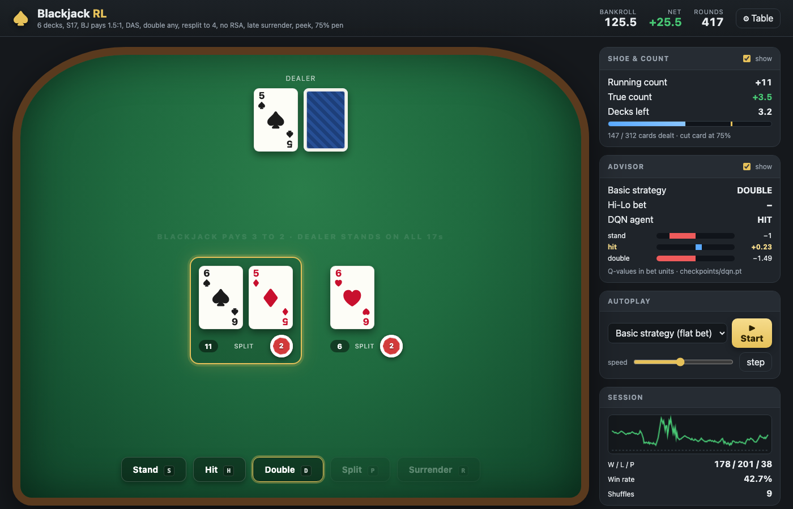
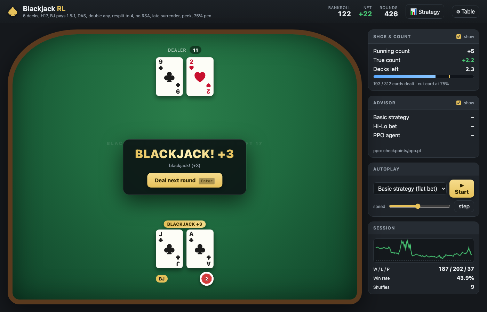
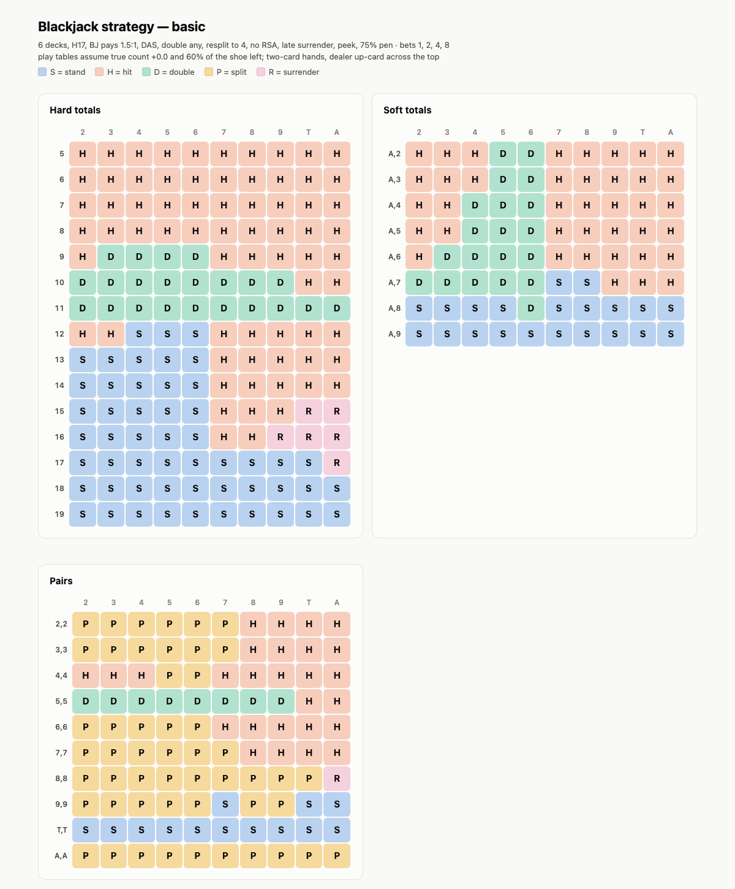
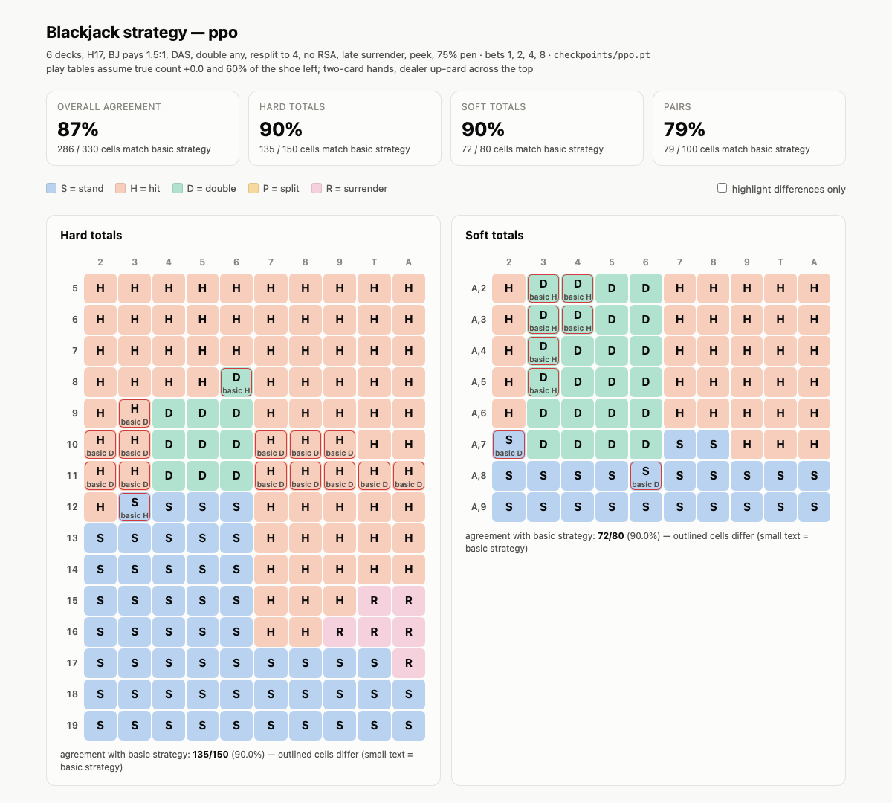

# blackjack-rl

A full-rules blackjack engine, a Gymnasium environment with **bet sizing and card counting**,
and a PPO agent that learns to play (and bet) — plus a browser (and terminal) game so you can play
the exact same environment yourself.



<details>
<summary>More screenshots</summary>



</details>

```
blackjack_rl/
├── engine/       pure-Python game engine (no RL deps): shoe + Hi-Lo count, hands, rules, round state machine
├── env/          Gymnasium env  "BlackjackFull-v0"  (bet phase → play phase, action mask, persistent shoe)
│                 + BlackjackVectorEnv: N envs stepped as a batch, auto-reset, subprocess workers
├── agents/       random, basic strategy (+ Hi-Lo bet spread), masked PPO (PyTorch)
├── cli/          blackjack-play / blackjack-train-ppo / blackjack-eval / blackjack-strategy
├── web/          blackjack-web: browser UI (stdlib HTTP server + vanilla JS) on top of the env
└── evaluation.py EV / variance / win-rate / bet-by-count statistics
tests/            pytest suite for the engine, env and baselines
```

## Setup

```bash
python3 -m venv .venv && source .venv/bin/activate
pip install -e ".[dev]"
pytest
```

## Play it yourself

### In the browser (recommended)

```bash
blackjack-web                              # opens http://127.0.0.1:8000; loads checkpoints/ppo.pt if present
blackjack-web --checkpoint checkpoints/ppo.pt --checkpoint runs/other.pt --s17 --bets 5,10,25 --port 9000
```

A casino-style table served straight from the RL environment: click chips to bet, keyboard
shortcuts (`1-9` bet, `H/S/D/P/R` play, `Enter` next round), split hands, hole-card reveal,
running/true count and shoe penetration, and an **advisor panel** showing what basic strategy,
Hi-Lo betting and the trained PPO agent would do — with the policy's probability for each action
(pass `--checkpoint` several times to compare runs side by side). **Autoplay** lets any agent
(basic / Hi-Lo / PPO) play the table while you watch, 📊 Strategy opens the selected agent's strategy report, and ⚙ Table
starts a new table with different rules, bet sizes and bankroll. Zero front-end dependencies — a
small stdlib HTTP server (`blackjack_rl/web`) + vanilla HTML/CSS/JS.

### In the terminal

```bash
blackjack-play                # 6 decks, H17, DAS, late surrender, bets 1/2/4/8
blackjack-play --hint         # shows the basic-strategy play and Hi-Lo bet suggestion
blackjack-play --s17 --decks 2 --bets 5,10,25 --hide-count
```

Both front-ends drive `BlackjackEnv` directly: you see the same observation the agent gets
(rendered as a table), pick from the same legal actions, and get the same reward.

## The environment

```python
import gymnasium as gym
import blackjack_rl                       # registers the env

env = gym.make("BlackjackFull-v0")        # or BlackjackEnv(rules=Rules(...), bet_sizes=(1, 2, 4, 8))
obs, info = env.reset(seed=0)
done = False
while not done:
    action = env.action_space.sample(mask=info["action_mask"])   # always mask!
    obs, reward, done, truncated, info = env.step(action)
print(info["profit"], info["results"])
```

* **Episode = one round.** It starts in the *bet phase* (actions `5..5+len(bet_sizes)-1` pick a bet size),
  then continues in the *play phase* with `0 STAND, 1 HIT, 2 DOUBLE, 3 SPLIT, 4 SURRENDER` for each hand.
* **The shoe persists across episodes** (reshuffled at the cut card), so the running/true count in the
  observation carries real information. Pass `reshuffle_each_round=True` to disable counting.
* **Observation** (22 floats in [-1, 1]): phase, hand total, soft/pair flags, legal-action flags,
  dealer up-card one-hot, true count, fraction of shoe left, current bet, number of hands. See `env/observation.py`.
* **Reward:** 0 until the round ends, then the round's profit in bet units (+1.5 for a natural on 1 unit,
  −4 for a lost doubled 2-unit bet, ...).
* **Illegal actions raise** `ValueError` — use `info["action_mask"]` / `info["legal_actions"]`.
* Rules are a frozen dataclass (`Rules`): decks, penetration, H17/S17, blackjack payout, peek, DAS,
  double restrictions, max splits, RSA, hit split aces, late surrender. Defaults are the common US
  shoe game: 6 decks, **dealer hits soft 17**, DAS, late surrender, peek, 3:2, 75 % penetration
  (`--s17` etc. on every CLI to change them).

## Baselines and evaluation

```bash
blackjack-eval --agent basic --rounds 1000000        # basic strategy, min bet
blackjack-eval --agent hilo  --rounds 1000000        # basic strategy + 1-2-4-8 Hi-Lo bet spread
blackjack-eval --agent random --rounds 100000
blackjack-strategy --agent basic                     # print the basic-strategy tables the agent is judged against
```

Sanity check: with the default rules basic strategy measures **−0.62 % ± 0.22 % of the initial bet
over 1M rounds**, matching the published house edge for 6D / H17 / DAS / LS (with `--s17` it measures
−0.40 % ± 0.22 %, again matching the published ≈ −0.4 %).

## Basic strategy reference

The chart the agents are measured against — default table (6 decks, **H17**, DAS, late surrender),
as rendered by `blackjack-strategy --agent basic --open`:



<details>
<summary>Same chart as text (<code>blackjack-strategy --agent basic</code>)</summary>

```
Legend: S=stand H=hit D=double P=split R=surrender   (2-card hands; dealer up-card across the top)

HARD          2   3   4   5   6   7   8   9   T   A
5              H   H   H   H   H   H   H   H   H   H
6              H   H   H   H   H   H   H   H   H   H
7              H   H   H   H   H   H   H   H   H   H
8              H   H   H   H   H   H   H   H   H   H
9              H   D   D   D   D   H   H   H   H   H
10             D   D   D   D   D   D   D   D   H   H
11             D   D   D   D   D   D   D   D   D   D
12             H   H   S   S   S   H   H   H   H   H
13             S   S   S   S   S   H   H   H   H   H
14             S   S   S   S   S   H   H   H   H   H
15             S   S   S   S   S   H   H   H   R   R
16             S   S   S   S   S   H   H   R   R   R
17             S   S   S   S   S   S   S   S   S   R
18             S   S   S   S   S   S   S   S   S   S
19             S   S   S   S   S   S   S   S   S   S

SOFT          2   3   4   5   6   7   8   9   T   A
A,2            H   H   H   D   D   H   H   H   H   H
A,3            H   H   H   D   D   H   H   H   H   H
A,4            H   H   D   D   D   H   H   H   H   H
A,5            H   H   D   D   D   H   H   H   H   H
A,6            H   D   D   D   D   H   H   H   H   H
A,7            D   D   D   D   D   S   S   H   H   H
A,8            S   S   S   S   D   S   S   S   S   S
A,9            S   S   S   S   S   S   S   S   S   S

PAIRS         2   3   4   5   6   7   8   9   T   A
2,2            P   P   P   P   P   P   H   H   H   H
3,3            P   P   P   P   P   P   H   H   H   H
4,4            H   H   H   P   P   H   H   H   H   H
5,5            D   D   D   D   D   D   D   D   H   H
6,6            P   P   P   P   P   H   H   H   H   H
7,7            P   P   P   P   P   P   H   H   H   H
8,8            P   P   P   P   P   P   P   P   P   R
9,9            P   P   P   P   P   S   P   P   S   S
T,T            S   S   S   S   S   S   S   S   S   S
A,A            P   P   P   P   P   P   P   P   P   P
```

</details>

`D` falls back to hit (hard 9–11, soft ≤ 17) or stand (soft 18/19) when doubling isn't allowed, `R` falls
back to hit (or stand for 17 vs A) — the same fallback logic `BasicStrategyAgent` uses. The H17-specific
cells are 11 vs A double, A,8 vs 6 double, A,7 vs 2 double, and surrender on 15 vs A, 17 vs A and 8,8 vs A.
`--s17`, `--no-das`, `--no-surrender`, `--decks N` etc. regenerate the chart for other tables;
`--agent hilo` adds the Hi-Lo bet spread.

## Vectorized env

```python
from blackjack_rl.env.vector_env import BlackjackVectorEnv

venv = BlackjackVectorEnv(1024, workers=8, seed=0)      # 1024 independent shoes, 8 processes
obs, mask = venv.reset()                                 # (N, 22) float32, (N, n_actions) bool
obs, reward, done, mask, info = venv.step(actions)       # finished rounds auto-reset; info: profit/wagered/true_count/bet
venv.close()
```

The game logic is pure Python, so the vector env shards the envs across subprocesses: on an M2 Max
1 worker ≈ 36k env-steps/s, 8 workers ≈ **240k env-steps/s (~110k rounds/s)** with a random policy —
enough that the neural network, not the environment, is the bottleneck.

## Train with PPO (uses the Apple GPU)

```bash
blackjack-train-ppo --total-rounds 50000000 --num-envs 2048 --workers 8 --device auto   # auto = mps > cuda > cpu
blackjack-eval --agent ppo --checkpoint checkpoints/ppo.pt --rounds 300000
blackjack-strategy --agent ppo --checkpoint checkpoints/ppo.pt --open       # learned tables vs basic strategy, bet spread
blackjack-web --checkpoint checkpoints/ppo.pt                              # advisor shows the policy's probabilities
```

`agents/ppo.py` is a masked actor-critic PPO: separate policy/value MLPs, GAE, clipped objective,
entropy bonus with linear anneal, Gumbel-max sampling so it runs on any device. Illegal actions are
masked out of the logits, so the agent never picks one and never gets gradient towards one. Rollouts
come from the vector env, so every forward pass is a batch of thousands of observations and each
update works on 65k transitions — that is where the GPU helps: on the M2 Max the same run does
**~40k rounds/s on MPS vs ~32k on CPU** with 1024 envs (≈ 60k rounds/s on MPS with 2048 envs).
Rewards are scaled by `1/max_bet`; a round's outcome is very noisy compared with the EV differences
between actions (often < 1 % of the bet), so the fine details of basic strategy — and the bet spread,
which only pays once the play is right — take tens of millions of rounds. `--total-rounds`,
`--ent-coef`, `--lr`/`--lr-end` and `--resume` are the knobs; `--bets 1` trains a flat-betting player.

`--html PATH` (or `--open`) on `blackjack-strategy` writes a self-contained, light/dark-aware **HTML
report**: colour-coded hard/soft/pairs charts with every disagreement vs basic strategy outlined
(hover a cell for the policy's probabilities), agreement tiles, the bet spread by true count against the
Hi-Lo reference, and the probability table per bet size. The same report is one click away in the
browser game (📊 Strategy).



Reference points (6D H17 DAS LS, bets 1/2/4/8, Apple M2 Max):

| run | wall time | EV / unit wagered | agreement with basic strategy (hard / soft / pairs) | bet spread |
|---|---|---|---|---|
| basic strategy, flat bet | – | −0.62 % | 100 % | flat |
| basic strategy + Hi-Lo 1-2-4-8 (benchmark) | – | ≈ −0.3 % … +0.3 % | 100 % | 1 → 8 from TC +2 |
| PPO, 50M rounds, `--ent-coef 0.005` | 28 min | −1.8 % | 85 / 93 / 54 % | none (flat 1; rarely doubles/splits, never surrenders) |
| PPO, 50M rounds, `--ent-coef 0.02` (default) | 28 min | **−1.05 %** (last 200k-round eval −0.5 %) | **90 / 90 / 79 %** | **1 → 2 → 4 from TC +3/+4**, EV/round positive at TC ≥ +3 |

The entropy coefficient turned out to be the important knob: with a small bonus the policy goes
deterministic within a few million rounds and never explores doubles, splits, surrender or bigger
bets; with `0.02 → 0.002` it keeps sampling those, matches basic strategy on 90 % of hard/soft cells,
surrenders like basic strategy does, and — the interesting part — learns on its own to raise its bet
when the true count is high, i.e. it discovers card counting from the count feature. It does not beat
the house yet: the remaining gaps are pairs (79 %) and the size of the spread (it stops at 4 units;
Hi-Lo goes to 8), both of which are the rarest situations in the data. `--resume checkpoints/ppo.pt
--total-rounds 100000000` is the cheap next experiment.
